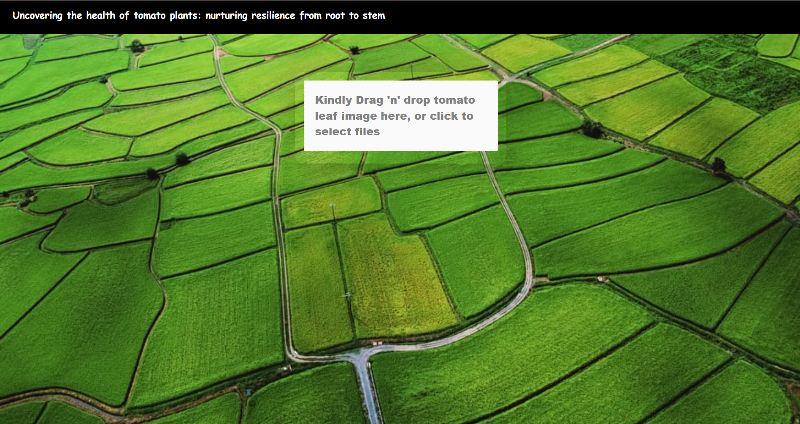
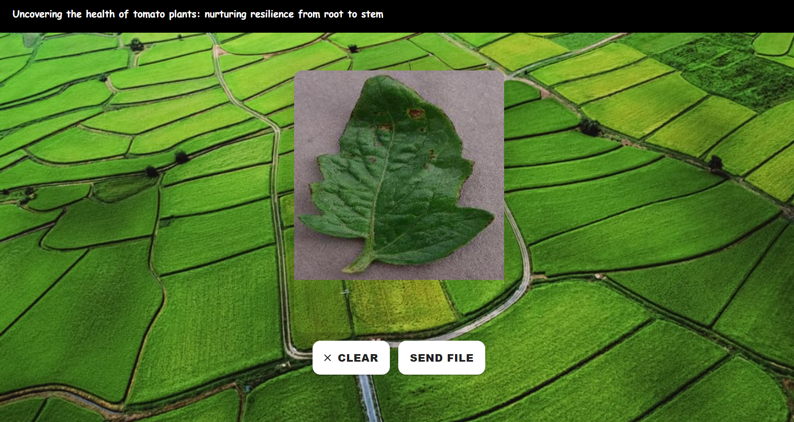
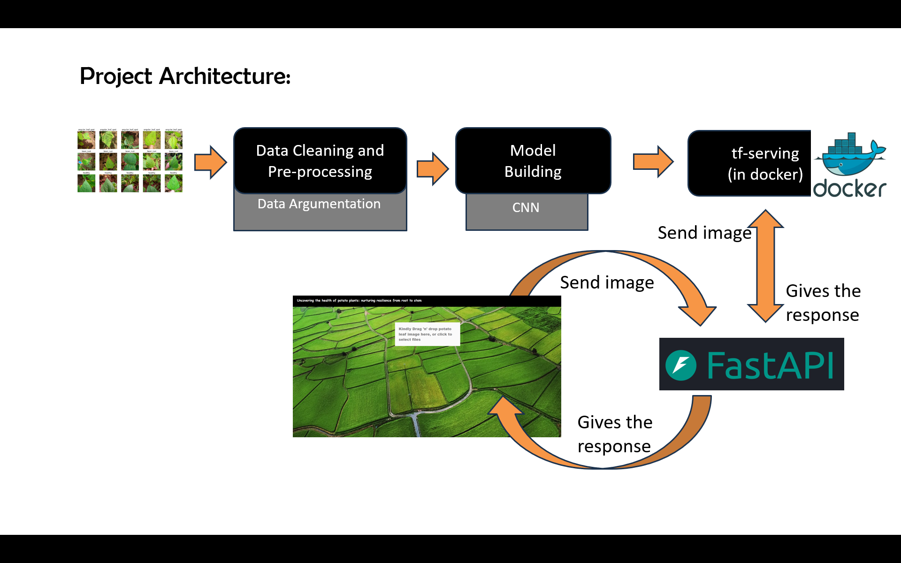

# Mission Tomato 

Mission Tomato is a full-stack application designed to predict tomato leaf diseases using a convolutional neural network (CNN) model. The application consists of a React frontend, a FastAPI backend, and a TensorFlow Serving setup for model predictions. The project is deployed on AWS using two instances: one for TensorFlow Serving in Docker and another for the frontend and backend.

## Project Components

### 1. Frontend Application
The frontend of the application is developed using React and Material-UI. It provides a user-friendly interface where users can upload images of tomato leaves and receive predictions about the health of the plants.

**Key features of the frontend:**
- **Image Upload:** Users can select an image file from their device and upload it.
- **Image Preview:** Once an image is selected, a preview is displayed.
- **Result Display:** The predicted disease and the confidence level of the prediction are shown to the user.
- **Clear Functionality:** Users can clear the uploaded image and results to start a new prediction.

### 2. Backend Application
The backend is implemented using FastAPI, a modern web framework for building APIs with Python. It handles the image upload, processes the image, and communicates with the machine learning model to get predictions.

**Key functionalities of the backend:**
- **Image Processing:** The uploaded image is converted into a format suitable for the model.
- **Model Serving:** The backend sends the processed image to a TensorFlow Serving model hosted in a Docker container.
- **Prediction Handling:** The model returns predictions which are then formatted and sent back to the frontend.

### 3. Machine Learning Model
The core of the project is the CNN model trained to classify tomato leaf images into ten categories: `Tomato_Bacterial_spot`, `Tomato_Early_blight`, `Tomato_Late_blight`, `Tomato_Leaf_Mold`, `Tomato_Septoria_leaf_spot`, `Tomato_Spider_mites_Two_spotted_spider_mite`, `Tomato__Target_Spot`, `Tomato__Tomato_YellowLeaf__Curl_Virus`, `Tomato__Tomato_mosaic_virus` and `Tomato_healthy`. This model is served using TensorFlow Serving in a Docker container, ensuring scalability and easy deployment.

## Project User Inteface





## Project Architecture




## Technical Workflow
1. **User Interaction:** The user uploads an image of a tomato leaf via the React-based frontend.
2. **Image Upload:** The image is sent to the FastAPI backend.
3. **Image Processing:** The backend processes the image and prepares it for prediction.
4. **Model Prediction:** The processed image is sent to the TensorFlow Serving model in Docker.
5. **Result Generation:** The model predicts the disease and returns the result to the backend.
6. **Display Results:** The backend sends the prediction back to the frontend, where it is displayed to the user.

## Benefits
- **Accurate Disease Detection:** Utilizing deep learning ensures high accuracy in disease detection.
- **User-Friendly Interface:** The React frontend makes it easy for users to interact with the system.
- **Scalability:** Docker and TensorFlow Serving allow for scalable and efficient model deployment.
- **Cross-Origin Resource Sharing (CORS):** The backend supports CORS, enabling smooth interaction between the frontend and backend hosted on different servers.

Mission-Tomato leverages cutting-edge technologies to provide an efficient solution for tomato disease detection, aiding farmers in maintaining crop health and improving agricultural productivity.

## Getting Started

### Prerequisites
- Node.js and npm
- Python 3.7+
- Docker
- TensorFlow Serving

### Installation

1. **Clone the repository:**
    ```sh
    git clone https://github.com/Dhurkesh-B/mission-tomato
    cd mission-tomato
    ```

2. **Setup Frontend:**
    ```sh
    cd frontend
    npm install
    npm start
    ```

3. **Setup Backend:**
    ```sh
    cd ..
    pip install -r requirements.txt
    uvicorn main:app --reload
    ```

4. **Setup TensorFlow Serving:**
    ```sh
    docker pull tensorflow/serving
    docker run -t -p 5000:5000 -v C:\Users\dhurk\OneDrive\mission-tomato:/mission-tomato tensorflow/serving --rest_api_port=5000 --model_config_file=/mission-tomato/models.config.a
    ```

### Usage

1. **Upload Image:**
   - Access the React frontend at `http://localhost:3000`.
   - Upload an image of a tomato leaf.

2. **Get Predictions:**
   - The backend processes the image and gets predictions from the TensorFlow Serving model.
   - The predicted disease and confidence level are displayed in the frontend.

## Contributing

Contributions are what make the open-source community such an amazing place to be learn, inspire, and create. Any contributions you make are **greatly appreciated**.

1. Fork the Project
2. Create your Feature Branch (`git checkout -b feature/AmazingFeature`)
3. Commit your Changes (`git commit -m 'Add some AmazingFeature'`)
4. Push to the Branch (`git push origin feature/AmazingFeature`)
5. Open a Pull Request

## Acknowledgements

- [TensorFlow](https://www.tensorflow.org/)
- [FastAPI](https://fastapi.tiangolo.com/)
- [React](https://reactjs.org/)
- [Material-UI](https://material-ui.com/)


